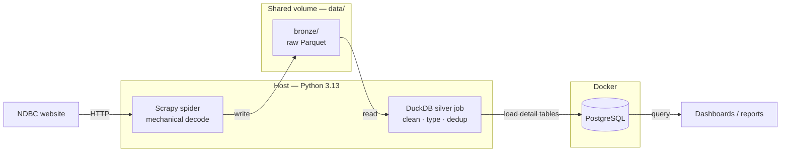

# NDBC Buoy Pipeline — Architecture

This project scrapes historical standard-meteorological data from the [NDBC](https://www.ndbc.noaa.gov/) buoy network and loads it into PostgreSQL for analysis. It is a **two-stage pipeline**, both stages running on the host:

- **Bronze** — Scrapy lands raw data (host).
- **Silver** — DuckDB cleans, types, and loads the serving store (host).

The guiding principle: **use the right tool for the scale.** The dataset fits comfortably on one machine, so the whole pipeline runs single-node, single-process — no cluster, no extra runtime.

## Quick path

```bash
make up          # start PostgreSQL (runs db/init.sql on first init)
make scrape      # crawl NDBC on the host -> raw Parquet in data/bronze/
make silver      # DuckDB: clean/type/dedup -> load Postgres detail tables
make test        # run the full pytest suite on the host
make down        # stop the stack (pgdata volume is preserved)
```

Pipeline order is **`scrape → silver`**. Silver reads bronze's output off the shared `data/` folder; it never redoes the scrape.

> `make scrape` crawls the **entire** NDBC historical archive. For a smoke test, limit it to one buoy first.

## The big picture



DuckDB is the only writer into PostgreSQL: it reads bronze Parquet, transforms it in SQL, and loads the two detail tables directly. There is no intermediate silver Parquet and no separate aggregation stage.

## Stages

| Stage | Engine | Runtime | Input | Output |
|-------|--------|---------|-------|--------|
| **1. Bronze** | Scrapy | Host, Python 3.13 | NDBC HTML + text | Raw Parquet in `data/bronze/` |
| **2. Silver** | DuckDB | Host, Python 3.13 | Bronze Parquet | Detail tables in Postgres |

### Stage 1 — Bronze ingestion

The spider (`spiders/ndbc_standard_meterological_spider.py`) does a **mechanical** whitespace decode only (`pd.read_csv(sep=r'\s+')`) — no renaming, no datetime, no unit-row removal. It emits one item per response and `BronzeParquetPipeline` writes one Parquet file per response into a Hive-partitioned tree:

```
data/bronze/
├── observations/buoy_id=<id>/year=<yyyy>/<source_stem>.parquet
└── coordinates/buoy_id=<id>/part.parquet
```

Re-scraping a file overwrites its own partition — ingest is idempotent.

### Stage 2 — Silver (DuckDB)

`ndbc_buoy_scraper/silver.py` runs on the host and does all the **semantic** work in SQL over DuckDB:

1. Read bronze with hive partitioning (`hive_types` pins `buoy_id`/`year` to `VARCHAR` so leading zeros survive) and `union_by_name` for per-year column drift.
2. Filter the NDBC units row (kept as raw data in bronze), **rename** the 14 NDBC codes, **normalize year** (2→4 digit), build **`datetime`** (UTC, minute folded in), **nullify sentinels** with a **per-column** table, **cast**, **dedup** on `(buoy_id, datetime)`.
3. Truncate-and-reload `buoy_observations` / `buoy_coordinates` in Postgres via DuckDB's `postgres` extension (`ATTACH`).

> **Gotcha handled here:** the raw NDBC header contains both `MM` (month) and `mm` (minute). DuckDB folds identifiers case-insensitively and renames the collision to `mm_1`; `silver.py` resolves the real minute column via `DESCRIBE` rather than hardcoding `mm`.

## Component map

| Path | Role |
|------|------|
| `ndbc_buoy_scraper/spiders/ndbc_standard_meterological_spider.py` | Crawl NDBC + mechanical decode; emit items |
| `ndbc_buoy_scraper/pipelines.py` | `BronzeParquetPipeline` — writes raw responses as partitioned bronze Parquet |
| `ndbc_buoy_scraper/silver.py` | **DuckDB silver ETL** — bronze Parquet → Postgres detail tables |
| `ndbc_buoy_scraper/coordinates_converter.py` | Parse NDBC coordinate strings → lat/lon |
| `db/init.sql` | DDL for both tables; column order **mirrors** silver.py exactly |
| `docker-compose.yml` | `postgres` service |
| `Makefile` | `scrape` / `silver` / `up` / `down` / `test` |
| `tests/` | `test_silver.py` (DuckDB transforms), `test_coordinates_converter.py` (pure) |

## Database schema

Two tables, both truncate-and-reloaded (no surrogate `id`; natural keys):

| Table | Loaded by | Grain | Key |
|-------|-----------|-------|-----|
| `buoy_observations` | DuckDB silver | one row per obs | `UNIQUE(buoy_id, datetime)` |
| `buoy_coordinates` | DuckDB silver | one row per buoy | `buoy_id` PK |

The DuckDB `postgres` extension inserts **positionally**, so `db/init.sql`'s `CREATE TABLE` column order must stay in sync with `silver.py`'s `OBSERVATION_COLUMNS` / `COORDINATE_COLUMNS`. Keep them aligned.

## Why it is built this way

| Decision | Reason |
|----------|--------|
| **Two runtimes** (Scrapy host / DuckDB host) | Each stage uses the engine that fits, without adding a container/runtime the dataset doesn't need. |
| **DuckDB for silver** | The ETL is per-file and embarrassingly parallel; the whole dataset fits one machine. DuckDB is multi-threaded, reads Parquet with pushdown, and bulk-loads Postgres directly — no cluster, no intermediate Parquet hop. |
| **Per-column sentinel table** | Blanket `99.0 → NULL` corrupts columns where 99 is valid data. |
| **Truncate-and-reload** | Simplest idempotent load. Upsert is the planned v2. |
| **Hive `hive_types` pin + `DESCRIBE` for minute** | Prevents DuckDB truncating leading-zero buoy IDs and mishandling the `MM`/`mm` collision. |

## Testing

All tests run on the host (Python 3.13, no Docker required):

| Command | Runs |
|---------|------|
| `uv run pytest tests/test_silver.py` | DuckDB transforms |
| `uv run pytest tests/` (or `make test`) | Everything |

Silver tests use synthetic bronze Parquet fixtures and assert the transform (sentinel nullification, year/minute handling, dedup) end to end.

## Known gaps & next steps

- **End-to-end never run.** The full `scrape → silver` chain against a live PostgreSQL has not been executed. The DuckDB `postgres` extension load is correct by inspection but untested against live Postgres. **Run a single-buoy smoke test before relying on the load.**
- **Out of scope (by design):** no orchestrator, no incremental scraping, no upsert (truncate-and-reload only).
