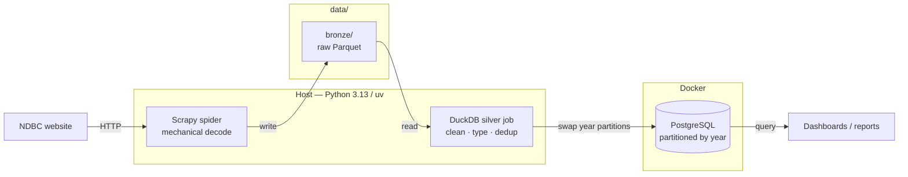

# NDBC Buoy Scraper

Scrapes historical standard-meteorological observations from the
[NDBC](https://www.ndbc.noaa.gov/) buoy network and loads them into PostgreSQL
for analysis.

Two stages, both running on the host; only Postgres is containerized.
`ARCHITECTURE.md` has the full design rationale — this file is how to run it.

## Architecture



| Stage | Engine | Input | Output |
|-------|--------|-------|--------|
| **1. Bronze** | Scrapy | NDBC HTML + text | Raw Parquet under `data/bronze/` |
| **2. Silver** | DuckDB | Bronze Parquet | Year partitions in Postgres |

The order is always **`scrape → silver`**. Silver reads what scrape wrote off
`data/`; it never re-crawls, and scrape never touches Postgres beyond recording
its own run.

**Bronze** is Hive-partitioned, one Parquet file per fetched source file:

```
data/bronze/
├── observations/buoy_id=<id>/year=<yyyy>/<source_stem>.parquet
└── coordinates/buoy_id=<id>/part.parquet
```

Re-scraping a file overwrites its own partition, so ingest is idempotent.

**Both stages are incremental**, which is the thing to understand before you run
either one:

- The spider skips year files already present in bronze. Closed years never
  change, so a second run costs ~1,350 requests instead of ~17,000. The
  `ndbc/skipped_cached` stat reports how many it skipped.
- The silver job fingerprints each year's bronze (file count + newest mtime) and
  rebuilds **only** the years whose fingerprint moved. Each rebuilt year is
  staged into a fresh table and swapped in as a partition atomically — readers
  see either the whole old year or the whole new one, never a gap.

Neither stage takes CLI flags. Everything is driven by environment variables.

## Requirements

- Python 3.13 and [uv](https://docs.astral.sh/uv/)
- Docker with Compose v2

## Setup

```bash
uv sync
cp .env.example .env      # then edit it
```

`.env` is the single config file. Compose reads it for the database
credentials, and the Python stages load it through
`ndbc_buoy_scraper/__init__.py`, so no exporting or sourcing is needed.

Two values you must get right:

- **`PG_PASSWORD`** has no default — Compose refuses to start without it.
- **`PG_PORT`** must match the published port in `docker-compose.yml`
  (`5434`), or the host-side stages cannot reach the database.

A real environment variable always beats `.env`, which is what makes
per-invocation overrides like `SILVER_FORCE=1 make silver` work.

Then start the database:

```bash
make up          # db/init.sql applies on first init of an empty data dir
```

## Running the stages

```bash
make scrape      # stage 1: crawl NDBC -> bronze Parquet
make silver      # stage 2: bronze -> Postgres year partitions
make pipeline    # both, in order, stopping at the first failure
```

> **`make scrape` crawls the entire NDBC archive.** The first run fetches
> ~17,000 year files and takes hours. Every run after that is incremental and
> takes minutes. For a smoke test, narrow the spider to one buoy first.

`make pipeline` runs them sequentially and fail-fast on purpose: loading bronze
that a crashed crawl left half-written would turn a visible failure into a
silent one.

### Useful overrides

| Variable | Effect |
|----------|--------|
| `NDBC_FULL_REFRESH=1` | Re-download every year instead of only missing ones. Turns a ~1,350-request run into ~17,000. |
| `SILVER_FORCE=1` | Rebuild every year partition regardless of bronze fingerprint. |
| `LOG_LEVEL=DEBUG` | Verbose Scrapy logging. |
| `DUCKDB_MEMORY_LIMIT`, `DUCKDB_THREADS` | Cap the silver job. Defaults are sized for a 4 vCPU / 6 GB box. |

Pass them per run rather than parking them in `.env`:

```bash
NDBC_FULL_REFRESH=1 SILVER_FORCE=1 make pipeline
```

## Running detached on a server

`make pipeline &` is the wrong tool: the run stays a child of your shell, so
losing the SSH connection SIGHUPs it. These targets hand the run to systemd
instead, so it becomes a child of PID 1 and journald owns the logs (Linux only):

```bash
make run-bg      # start a detached run, returns immediately
make logs        # follow it; Ctrl-C or a dropped connection stops only the tail
make status      # still running, or how did it end
make stop        # abort it
```

There is no schedule and nothing to install — the unit is created on demand and
removed when the run exits.

## Operating it

```bash
make health      # freshness probe; exits non-zero when stale
make db-config   # prove the tuned Postgres config actually loaded
make down        # stop Postgres (the data directory is preserved)
```

`make health` is the check that matters, and it exists because exit status is
not enough. A crawl can finish green and still load nothing — NDBC changes its
page markup and an XPath stops matching. Exit status cannot see that; the age of
the newest observation can.

The pipeline records its own runs, so the database is the monitoring backend:

```sql
-- Last 10 runs, both stages
SELECT stage, status, started_at, finished_at - started_at AS duration,
       rows_loaded, years_loaded, rows_rejected
FROM pipeline_runs ORDER BY started_at DESC LIMIT 10;

-- THE metric: how stale is the data?
SELECT now() - (max(datetime) AT TIME ZONE 'UTC') AS data_age
FROM buoy_observations;

-- Rows the transform could not place in a year partition
SELECT year, rows_loaded, rows_rejected, loaded_at
FROM observation_partitions WHERE rows_rejected > 0 ORDER BY year;
```

## Testing

```bash
make test                             # everything, on the host
uv run pytest tests/test_silver.py    # DuckDB transforms only
```

No Docker required — the silver tests build synthetic bronze Parquet fixtures
and assert the transform end to end.

## Schema

| Table | Grain | Notes |
|-------|-------|-------|
| `buoy_observations` | one row per observation | `PARTITION BY RANGE (datetime)`, one partition per year |
| `buoy_coordinates` | one row per buoy | `buoy_id` primary key |
| `pipeline_runs` | one row per stage run | written by both stages |
| `observation_partitions` | one row per year loaded | row counts and rejects |

DuckDB's `postgres` extension inserts **positionally**, so the column order in
`db/init.sql` must stay in sync with `OBSERVATION_COLUMNS` /
`COORDINATE_COLUMNS` in `silver.py`. Changing one without the other loads data
into the wrong columns without erroring.

## Backups

**Back up `data/bronze`, not Postgres.** Every row in the database is derived
and reproducible by re-running `make silver`. Bronze is the only irreplaceable
artifact, and it is far smaller than the database it produces.

## Layout

| Path | Role |
|------|------|
| `ndbc_buoy_scraper/spiders/` | Crawl + mechanical decode |
| `ndbc_buoy_scraper/pipelines.py` | Writes bronze Parquet partitions |
| `ndbc_buoy_scraper/silver.py` | DuckDB ETL → Postgres partitions |
| `ndbc_buoy_scraper/extensions.py` | Records crawls in `pipeline_runs` |
| `ndbc_buoy_scraper/healthcheck.py` | Freshness probe |
| `ndbc_buoy_scraper/__init__.py` | Loads `.env` before anything reads it |
| `db/init.sql` | Schema; column order mirrors `silver.py` |
| `db/postgresql.prod.conf` | Tuned Postgres config, applied on every machine |
| `Makefile` | Every command above |
